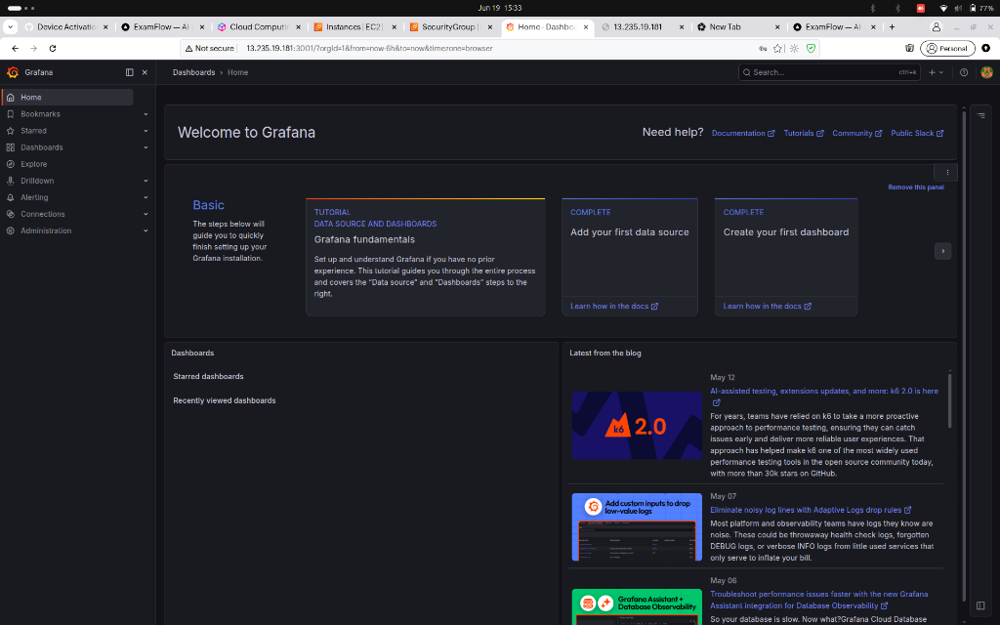

# Kind Care Feedback

A modern, web-based patient feedback platform designed for hospitals and healthcare providers to seamlessly collect, analyze, and manage patient experiences.


## 🚀 Tech Stack

### Frontend
- **Framework:** React 19, Vite, TanStack Start (Server-Side Rendering)
- **Routing & Data:** TanStack Router, TanStack Query
- **Styling:** Tailwind CSS 4, Radix UI components
- **Forms:** React Hook Form, Zod

### Backend
- **Framework:** Node.js with Express
- **Database:** MySQL 8 via `mysql2` driver
- **Authentication:** JWT (JSON Web Tokens), `bcryptjs` for password hashing

### Infrastructure & Deployment
- **Containerization:** Docker & Docker Compose
- **Reverse Proxy:** Nginx
- **Monitoring:** Prometheus, Grafana, cAdvisor, Node Exporter, MySQL Exporter
- **CI/CD:** GitHub Actions (Automated build, Trivy security scan, AWS EC2 deployment)

## 🌟 Features
- **Intuitive Feedback Collection:** Beautiful, responsive UI built with Tailwind CSS and Radix UI.
- **Admin Dashboard:** Secure authentication system for staff to view and analyze feedback.
- **Robust Monitoring:** Built-in observability stack with Prometheus and Grafana for system health and metrics.
- **Automated CI/CD:** Push to main triggers automated testing, container builds, vulnerability scanning, and zero-downtime deployment to AWS EC2.
- **Server-Side Rendering:** Improved SEO and initial load times via TanStack Start.

## 🛠️ Getting Started Locally

### Prerequisites
- [Docker](https://docs.docker.com/get-docker/) & [Docker Compose](https://docs.docker.com/compose/install/)

### Running via Docker Compose (Recommended)

The easiest way to get the entire stack running—including the database and monitoring tools—is using Docker Compose.

1. **Navigate to the deployment directory:**
   ```bash
   cd deployment
   ```

2. **Configure Environment Variables:**
   Copy the example environment file and update any necessary values.
   ```bash
   cp .env.example .env
   ```

3. **Start the Stack:**
   Run the containers in detached mode.
   ```bash
   docker-compose up -d
   ```

### 🗺️ Services Map

Once the Docker Compose stack is up and running, you can access the services at:

| Service | Local URL |
|---------|-----------|
| **Frontend** | `http://localhost:3000` |
| **Backend API** | `http://localhost:4000` |
| **Nginx Proxy** | `http://localhost:80` |
| **Grafana** | `http://localhost:3001` (User: `admin` / Password: set in `.env`) |
| **Prometheus** | `http://localhost:9090` |
| **cAdvisor** | `http://localhost:8080` |
| **Node Exporter** | `http://localhost:9100` |

## 📊 Infrastructure Monitoring

The project includes a pre-configured Grafana dashboard (`KauFeedback Infrastructure`) that provides real-time insights into system health, container resource utilization, and database connections.



## ⚙️ Development

If you prefer to run the services natively for development:

1. **Frontend:**
   ```bash
   cd frontend
   bun install # or npm install
   bun run dev
   ```

2. **Backend:**
   Ensure your local MySQL instance is running and update the `.env` in the backend directory.
   ```bash
   cd backend
   npm install
   npm run dev
   ```

## 🔄 CI/CD Pipeline

The project utilizes GitHub Actions for seamless deployment (`.github/workflows/deploy.yml`):
1. **Security Scan:** Analyzes code with Gitleaks and SonarQube.
2. **Build & Scan:** Builds Docker images for the frontend and backend, scans them with Trivy for vulnerabilities, and pushes to Docker Hub.
3. **Deploy:** Copies configuration files to an AWS EC2 instance and safely restarts the stack with the latest images.

## 📜 License

This project is licensed under the MIT License.
